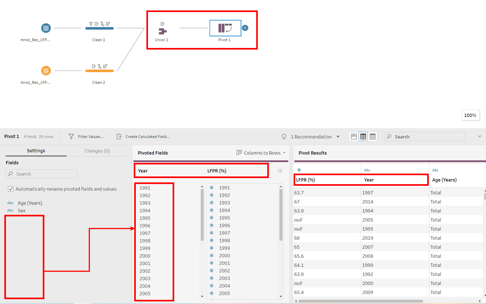

```{r setup, include=FALSE, results='asis'}
options(htmltools.dir.version = FALSE, knitr.duplicate.label = "allow")
knitr::opts_chunk$set(
  fig.retina = 3,
  cache = FALSE,
  echo = TRUE,
  message = FALSE, 
  warning = FALSE)
```

# 1 Overview

In this dataviz makeover, we will critique the following visualisation of labour force participation rate in Singapore from 2010 to 2021, and design a suitable visualisation for the data.


The source of the data is obtained from the Ministry of Manpower, Singapore (MOM), [Resident Labour Force Participation Rate by Age and Sex](https://stats.mom.gov.sg/Pages/LabourForceTimeSeries.aspx).  

# 2 Critique

## 2.1 Clarity

1.	**Chart Title**
    + ‘Labour force participation rate’, contains too little details about the information in the visualisation.
    + The title does not indicate who the dataset or visualisation belongs to, leading the viewer to interpret it by himself, which may cause some confusion as it could be any locations around the world.
    + The period of data used is also not stated.
    + The attributes used to analyse the data is unclear.
2.	**Y-Axis title** 
    + As the acronym ‘Lfpr’ was not described or mention in the title, readers may not be able to decipher what it means. Suggest to either label the acronym in the title, or spell out the acronym in full, if space available.
    + The units for the y-axis, ‘%’ in this case, was also not clearly defined, bringing little meaning to the values on the axis.
3.	**Chart Type in appropriate**
    + Area chart is typically used to represent cumulative sum over time. In this scenario, the data provided does not represent the rate against Singapore population, but rate respective to its individual age group population. Hence, chart type is not suitable and suggest using line chart to display time-series data. 
4.	**X-Axis labels** 
    + Due to the chart type selected, the plot results in multiple y-axis cramming into the chart, which makes it difficult to observe the the trends for each age group.
    + The year indicates that 2015 data was used, but upon further inspection of the tip of the area chart, it seems to be series of years (2010 – 2021) instead. This will be misleading to the reader as the chart does not coincide with the time indicated. Suggestion is to clearly label and indicate the range of the axis.
    + The age group is ordered based on ascending labour force participation rate, readers must move left and right through the axis to identify the subsequent age groups for comparison. It complicates the visualisation process for the reader and would be clearer if the age groups were ordered in ascending/descending age groups instead.
5. **Annotation/Source**
    + There is a lack of annotation and the title on the graph does not showcase any finding or conclusion.
    + There is no recognition of the data source in the caption.

## 2.2 Aesthetic

1.	**X-axis label names** 
    + Labels for individual ‘Age-group’ is very congested, such that some are even truncated, making it difficult to decipher and read. The labels can be tilted such that the full age groups remain readable. 
    + Only ‘2015’ label for ‘Year’ is present in the chart, and axis title ‘Year’ is unnecessarily repeated for each age group. Suggest having more tick marks for year, and to label the axis once only in the middle.
2.	**Y-axis scale and tick marks**
    + Tick marks are missing for continuous participation rate data.
    + Scale of major tick marks can be improved to every 10% to show finer details to easily observe the increase in Lfpr over time.
3.	**Legend and colour shading** 
    + The colour shading and legend of the graph is unnecessary as the age-groups are already labelled in the x-axis. It not only causes reader to lose clarity, but also competes for attention as each colour does not correspond to a meaning.
4. **Grid line** 
    + The vertical grid lines are redundant because the reader is unable to identify the range of the ‘Year’ in the x-axis.
    + Minor horizontal grid lines can be added for every 10% to allow readers to fill up the gaps between and for readers to easily gauge the increase in Lfpr over time.  

# 3 Proposed Design

A sketch of the proposed design is as follows:


## 3.1 Clarity

1.	**Chart Title**
    + Location, period of data and main attributes to be located in the main title of the dashboard to allow the reader to anticipate the type of visualisation he will be seeing.
    + A chart title is added for each chart that showcases the main finding of the visualisation.
    + A functional subtitle will also be included for each chart, to allow the reader to deep dive into the granularity of the data, such as age groups, gender and time period used.
    + The acrononym LFPR (Labour Force Participation Rate) will also be defined in the subtitle to allow the readers to decipher the meaning easily.
2.	**Y-Axis** 
    + The units used (%) is included in the y-axis
    + The acronym 'LFPR' can be inferred from the subtitle of the chart.
3.	**Chart Type**
    + A time-series line chart was used for the first visualisation as it can showcase the changes in LFPR over time for several age groups on a single x-axis. The age group were then colour-coded and their respective lines labelled for identification by reader
    + A bar-chart was used to compare the LFPR for gender across time. They will be split into 2 charts - 1 before retirement age of 65, and 1 after. This is to allow the user to deep dive into the insights on gender, general working population as well as those above retirement age.
4.	**X-Axis** 
    + As the first chart is plotted on a single x-axis, the scale of the time period (year) used can be labelled with tick marks for each individual year. Hence the reader can clearly identify the corresponding data points for each year, preventing confusion. 
    + Sorting is not required on the visualisation but the legend is sorted in ascending age groups for easier reference.
5. **Annotation/Source**
    + Annotations are included to highlight interesting findings in the charts.
    + The data source is added in the caption at the bottom of the dashboard.

## 3.2 Aesthetic

1.	**X-axis** 
    + For the first chart, the time period in years are labelled across the x-axis. As a single x-axis is used, there are no unnecessary repetition of labels and axis titles, preventing congestion and lowering readability of the data.
    + For the second chart, only 2 large age groups were selected, as the x-axis will be repeated 4 times (2 age group X 2 gender), to prevent congestion and maintain a suitable level of readability for the user.
2.	**Y-axis**
    + The scale of major tick marks was reduced every 10% wherever possible,  to show finer details and easily observe the increase in Lfpr over time.
    + Tick marks were added continuous participation rate data.
3.	**Legend and colour labels** 
    + The colour shading and legend of the graph was maintained to differentiate the line charts for each age groups. The intention of the colour is to help the reader easily identify the age group especially when a portion of the graph may become congested with lines. 
    + The line chart was also labelled according to the colour used, to allow the reader to directly identify the age group of the line. As some labels overlap due to congestion, we may choose to label it on different ends of the chart.
    + As the line chart is expected to consist of > 10 lines, colour choices may be limited as it becomes difficult to stick to pale colours only. Pale colours may be used for normal information, whereas darker or brighter colours may be used to highlight important information.
    + The bar chart is divided into gender, and the plan is to segregate the colours according to the gender. 
4. **Grid line** 
    + The vertical grid lines were removed as the year can be clearly identified.
    + The horizontal grid lines were maintained to allow readers to approximately match the LFPR value of each data point. If the data points are labelled, the grid lines can be removed as well.

# 4 Visualisation 

## 4.1 Data Visualisation

The proposed visualisation can be viewed on [Tableau Public](https://public.tableau.com/app/profile/ranice1917/viz/Dataviz1LFPR/SingaporeLabourForceParticipationRate).


# 5 Step-by-Step Preparation

## 5.1 Data Preparation

Step | Description | Action
:-: | -----------| :---------------:
1 | ‘Sex’ column to segregate the gender was added using excel as the row_number() function in Tableau prep required a field to order the rows, which is not available in the dataset.| {width=100%}
2 | Load the LFPR excel file into Tableau Prep Builder. Drag the ‘LFPR_1’ and ‘LFPR_2’ worksheet into main pane.| {width=100%}
3 | Click ‘Cleaned with Data Interpreter’ checkbox for tableau prep to detect the rows and columns of the dataset. Initiate the cleaning node from each data node.| {width=100%}
4 | Change field types of columns ‘1995’, ‘2000’ and ‘2005’ from ‘String’ to ‘Number (decimal)’.| {width=100%}
5 | As there are 2 columns for 2007 entry, ‘2007’ and ‘2007a’, we will keep the latest and revised information ‘2007a’ and remove ‘2007’.| {width=100%}
6 | Combine the ‘Clean 1’ and ‘Clean 2’ datasets together and remove ‘Table Names’ field. | {width=100%}
7 | Initiate the pivot node from the ‘Union 1’ node. Rotate the year ‘1991’ - ‘2021’ from columns to rows. Rename pivoted fields and pivoted field values to ‘Year’ and ‘LFPR (%)’ respectively.| {width=120%}
8 | Dataset is ready to be previewed in Tableau Desktop.| {width=100%}

## 5.2 Visualisation Preparation

Step | Description | Action
:-: | -----------| :---------------:
1 | For Chart 1, create a new worksheet named ‘Overall LFPR’. Drag ‘Year’ to ‘Columns’ and ‘LFPR(%)’ to ‘Rows’ shelves.| {width=60%}
2 | Drag ‘Age (Years)’ to the filter panel, and filter age for every 5-yearly interval. Drag ‘Year’ to the filter panel and filter for years 2010 – 2021. Drag ‘Sex’ to the filter panel and filter for overall.| {width=120%}
3 | Under the ‘Marks’ panel, select ‘Line’. Drag ‘Age (Years)’ to colour and label, to differentiate the lines using colours and add labels.| {width=30%}
4 | Update the title to include a main active title and functional subtitle. Hide ‘Year’ field label. Adjust the y-axis scale. Add label marks for missing values and adjust font size to prevent congestion. Change the colours of the lines to desired colours. Format the font of the axis labels if required.| {width=120%}
5 | For Chart 2, create a new worksheet named ‘LFPR by Gender’. Drag ‘Age (Years)’, ‘Sex’ and ‘Year’ to ‘Columns’ and ‘LFPR(%)’ to ‘Rows’ shelves.| {width=120%}
6 | Drag ‘Age (Years)’ to the filter panel, and filter age for ’25 to 64’ and ‘65&Over’. Drag ‘Year’ to the filter panel and filter for years 2010 – 2021. Drag ‘Sex’ to the filter panel and filter for ‘Females’ and ‘Males’.| {width=150%}
7 | Under the ‘Marks’ panel, select ‘Bar’. Drag ‘Sex’ to colour and ‘LFPR%’ to label, to differentiate and label the bars.| {width=30%}
8 | Update the title to include a main active title and functional subtitle. Hide ‘Age (Years)/ Sex/ Year’ field label. Adjust the y-axis scale. Change the colours of the lines to desired colours. Format the font of the axis labels if required.| {width=120%}
9 | Add annotation to charts with interesting insights. Adjust the shading of the box to allow some of the background to be seen.| {width=120%}
10 | Create a Dashboard named LFPR. Drag ‘Overall LFPR’ worksheet to the top and ‘LFPR by Gender’ worksheet to the bottom. Adjust ratio of chart to get a good visibility of both charts. Remove the legend of both charts. Add a dashboard title and caption at the bottom of the dashboard.| {width=120%}
11 | Publish the dashboard to Tableau Public. Adjust the size of the dashboard until the visualisation can be viewed properly on the website.| {width=120%}

# 6 Observations

1. **Overall Labour Force Participation Rate**
    + In general, most age groups seem to be looking at an increase in LFPR over the past decade with the exception of ages 15-24. The age group 15-19 remain relatively constant, whereas the age group 20-24 shows a gradual decrease in the LFPR. This may be attributed to more young adults pursuing tertiary education options before entering the workforce. 
    + The increase in LFPR starts from 25 years old, with older age groups seeing larger increases, especially the 65 to 69 group increasing by 20% over 10 years. Despite the increasing trend, the overall LFPR of Singapore residents only increased slightly, less than 5%, which indicates an ageing workforce in Singapore. As such, to retain industry knowledge and economical growth with a looming silver tsunami, the retirement age in Singapore is targeted to be raised from 62 to 65 by 2030 [(Source)](https://www.mom.gov.sg/newsroom/press-releases/2021/1101-retirement-and-re-employment-amendment-bill-2021-and-cpf-amendment-bill-2021#:~:text=Stipulating%20that%20the%20Minister%20for,respectively%20on%201%20July%202022.).
    
2. **Labour Force Participation Rate by Gender**
    + For the main workforce from ages 25-64, increase in working women may be a contributing factor to the increase in overall LFPR and age groups as seen in the first chart. This can be inferred from the second chart, whereby the women age 25-64 in the workforce increased by about 10% in the past decade.
    + For the older workforce, both female and male residents see an increase of more than 10% in LFPR in the past 10 years. This further strengthens the point on Singapore's ageing population, where a higher dependency on the older generation may be required for knowledge retention.