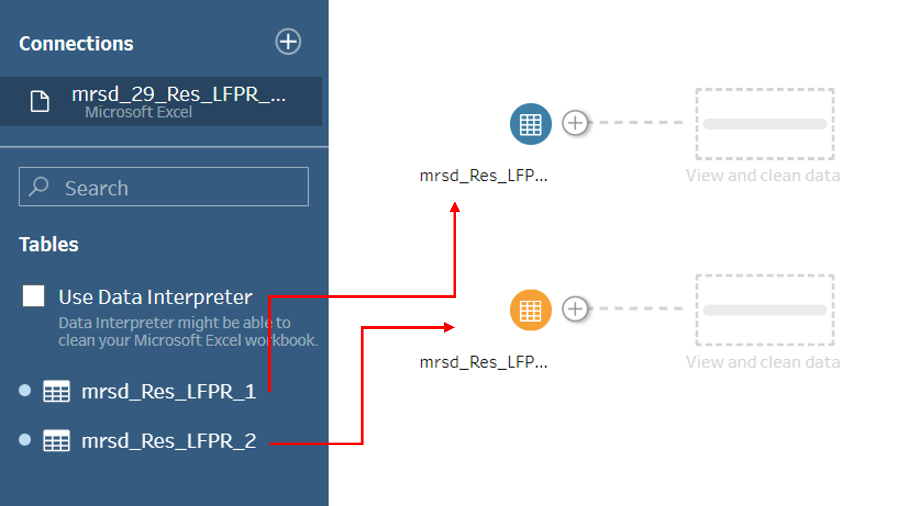
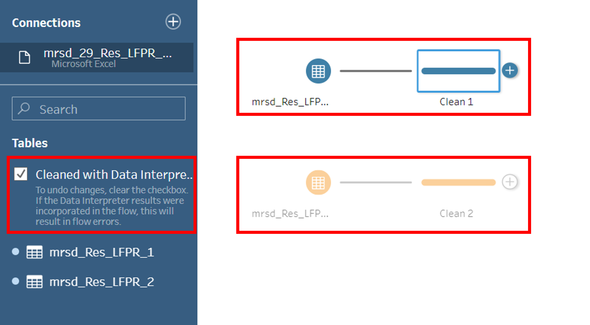
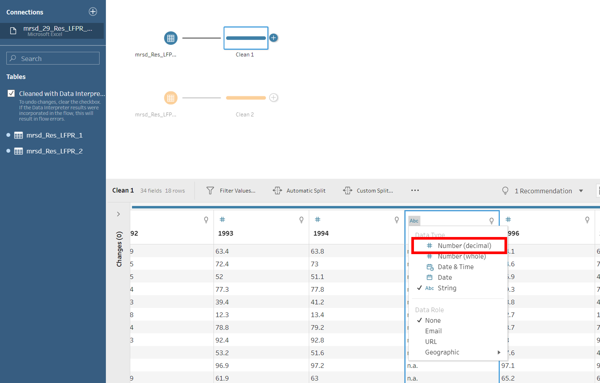
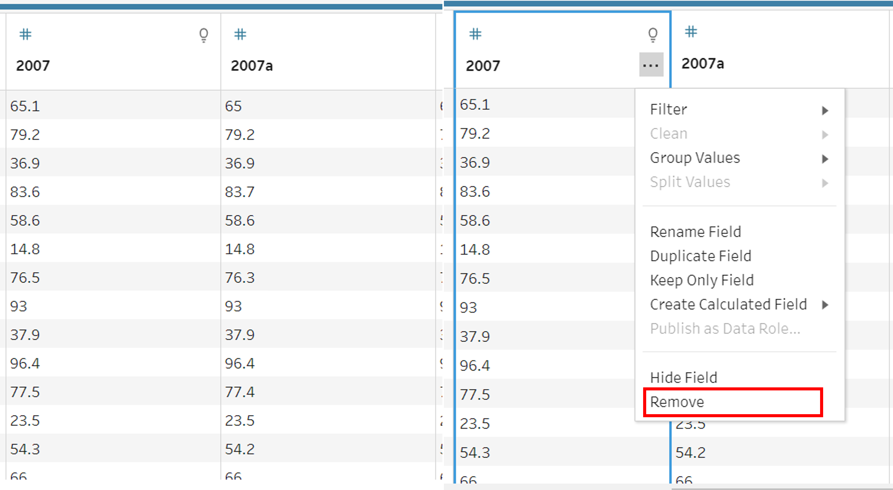
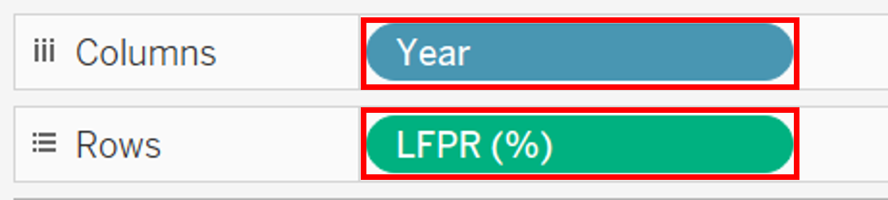
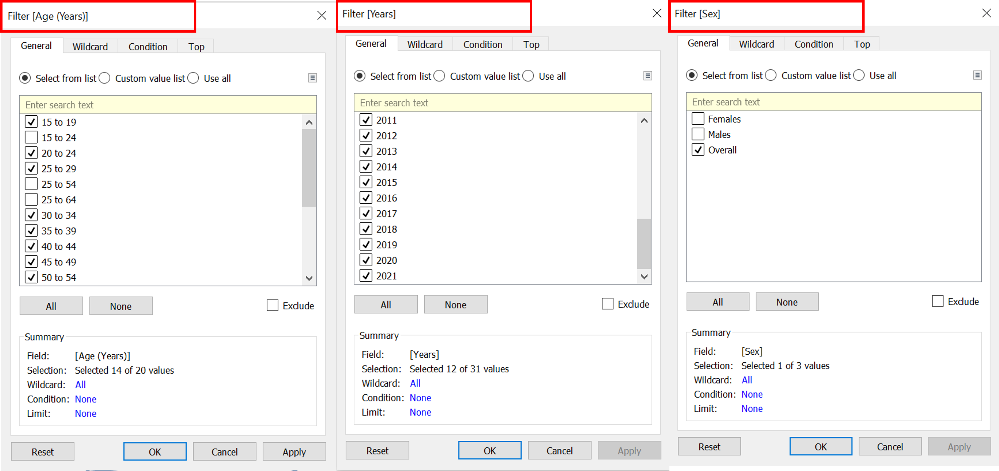
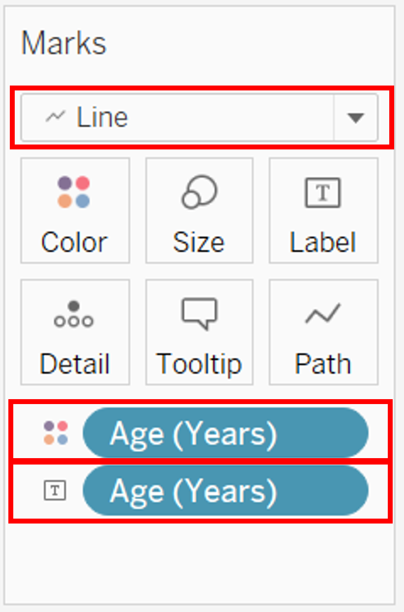
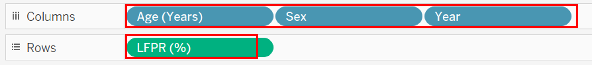
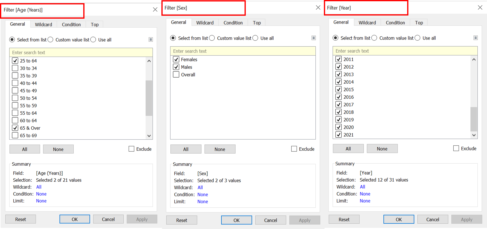
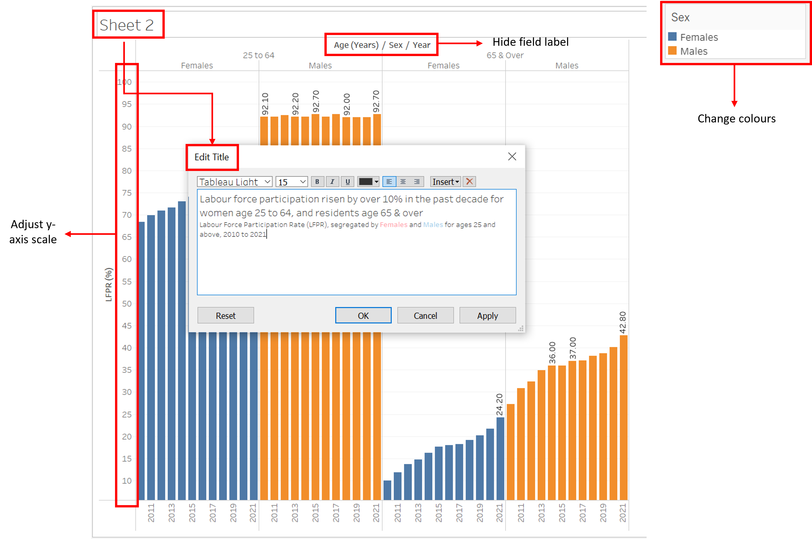

```{r setup, include=FALSE}
knitr::opts_chunk$set(echo = TRUE)
```


Step | Description | Picture
--- | ----------| -------------
1 | ‘Sex’ column to segregate the gender was added using excel as the row_number() function in Tableau prep required a field to order the rows, which is not available in the dataset.| 
2 | Load the LFPR excel file into Tableau Prep Builder. Drag the ‘LFPR_1’ and ‘LFPR_2’ worksheet into main pane.| 
3 | Click ‘Cleaned with Data Interpreter’ checkbox for tableau prep to detect the rows and columns of the dataset. Initiate the cleaning node from each data node.| 
4 | Change field types of columns ‘1995’, ‘2000’ and ‘2005’ from ‘String’ to ‘Number (decimal)’.| 
5 | As there are 2 columns for 2007 entry, ‘2007’ and ‘2007a’, we will keep the latest and revised information ‘2007a’ and remove ‘2007’.| 
6 | Combine the ‘Clean 1’ and ‘Clean 2’ datasets together and remove ‘Table Names’ field. | 
7 | Initiate the pivot node from the ‘Union 1’ node. Rotate the year ‘1991’ - ‘2021’ from columns to rows. Rename pivoted fields and pivoted field values to ‘Year’ and ‘LFPR (%)’ respectively.| 
8 | Dataset is ready to be previewed in Tableau Desktop.| 


Step | Description | Picture
--- | ----------| -------------
1 | For Chart 1, create a new worksheet named ‘Overall LFPR’. Drag ‘Year’ to ‘Columns’ and ‘LFPR(%)’ to ‘Rows’ shelves.| 
2 | Drag ‘Age (Years)’ to the filter panel, and filter age for every 5-yearly interval. Drag ‘Year’ to the filter panel and filter for years 2010 – 2021. Drag ‘Sex’ to the filter panel and filter for overall.| 
3 | Under the ‘Marks’ panel, select ‘Line’. Drag ‘Age (Years)’ to colour and label, to differentiate the lines using colours and add labels.| 
4 | Update the title to include a main active title and functional subtitle. Hide ‘Year’ field label. Adjust the y-axis scale. Add label marks for missing values and adjust font size to prevent congestion. Change the colours of the lines to desired colours. Format the font of the axis labels if required.| 
5 | For Chart 2, create a new worksheet named ‘LFPR by Gender’. Drag ‘Age (Years)’, ‘Sex’ and ‘Year’ to ‘Columns’ and ‘LFPR(%)’ to ‘Rows’ shelves.| 
6 | Drag ‘Age (Years)’ to the filter panel, and filter age for ’25 to 64’ and ‘65&Over’. Drag ‘Year’ to the filter panel and filter for years 2010 – 2021. Drag ‘Sex’ to the filter panel and filter for ‘Females’ and ‘Males’.| 
7 | Under the ‘Marks’ panel, select ‘Bar’. Drag ‘Sex’ to colour and ‘LFPR%’ to label, to differentiate and label the bars.| 
8 | Update the title to include a main active title and functional subtitle. Hide ‘Age (Years)/ Sex/ Year’ field label. Adjust the y-axis scale. Change the colours of the lines to desired colours. Format the font of the axis labels if required.| 
9 | Add annotation to charts with interesting insights. Adjust the shading of the box to allow some of the background to be seen.| 
10 | Create a Dashboard named LFPR. Drag ‘Overall LFPR’ worksheet to the top and ‘LFPR by Gender’ worksheet to the bottom. Adjust ratio of chart to get a good visibility of both charts. Remove the legend of both charts. Add a dashboard title and caption at the bottom of the dashboard.| 
11 | Publish the dashboard to Tableau Public. Adjust the size of the dashboard until the visualisation can be viewed properly on the website.| 


<style>
.column-left{
  float: left;
  width: 33%;
  text-align: left;
}
.column-center{
  display: inline-block;
  width: 33%;
  text-align: center;
}
.column-right{
  float: right;
  width: 33%;
  text-align: right;
}
</style>


<div class="column-left">

 
</div>
<div class="column-center">


</div>
<div class="column-right">


</div>