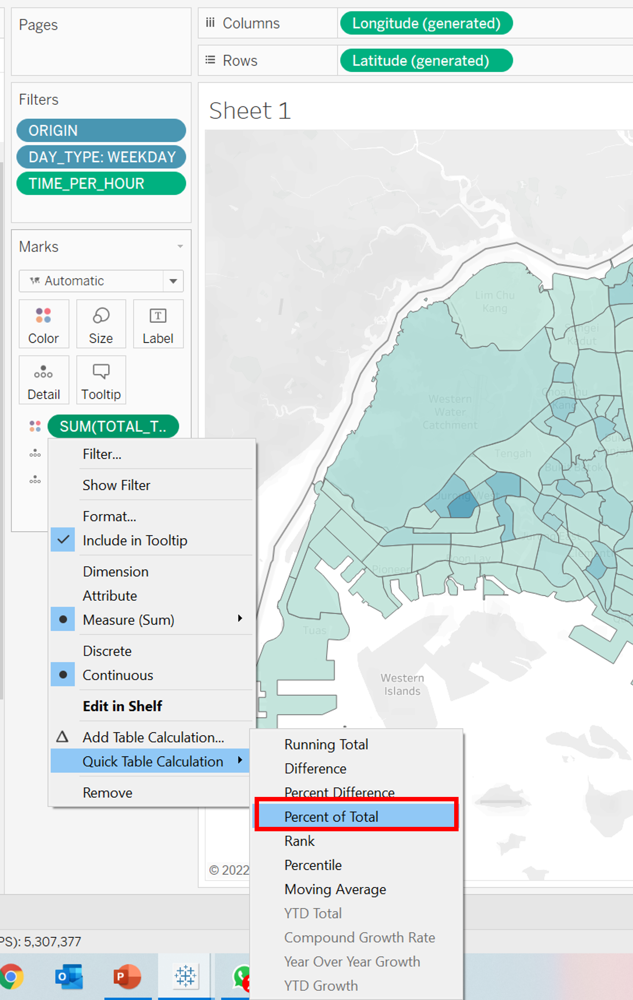
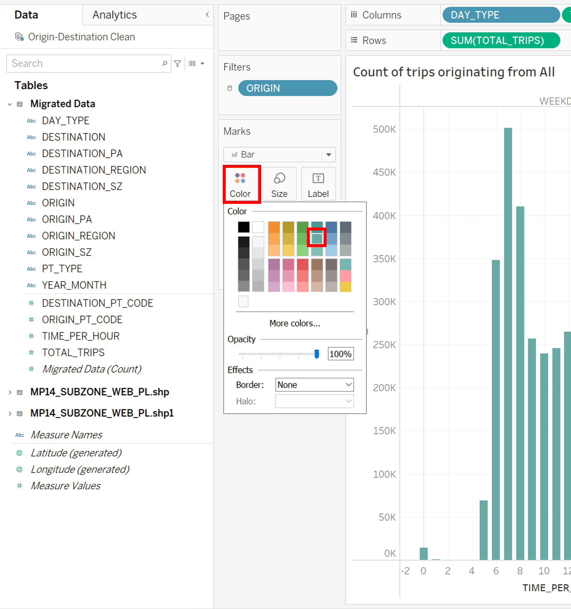

```{r setup, include=FALSE, results='asis'}
options(htmltools.dir.version = FALSE, knitr.duplicate.label = "allow")
knitr::opts_chunk$set(
  fig.retina = 3,
  cache = FALSE,
  echo = TRUE,
  message = FALSE, 
  warning = FALSE)
```

# 1 Overview

In this dataviz makeover, we will critique the following visualisation of origin-destination of public bus trips in Singapore in January 2022, and design a suitable visualisation for the data.


The bustrips dataset obtained from LTA Datamall overlayed with URA region, planning area and planning subzone using GIS Overlay operation. The URA Master Plan 2014 Planning Subzone boundary map used for plotting geospatial maps was downloaded from [data.gov.sg](data.gov.sg).

# 2 Critique

## 2.1 Clarity

1.	**The title of the dashboard is lacking information for the reader to comprehend the chart sufficiently. ** Even though it can be inferred that this is an origin-destination analysis, it is unclear to the audience what is the mode of transportation used for measuring the trips, what is the time period of the data used, and at what level of region/zone is the data being compared at. The information should be mentioned clearly in the title to allow the viewer to understand what data exactly he is looking at. In this case, it would be the inter and intra zonal bus trips in Singapore, compared at subzone level, using data in January 2022.

2.	**Abbreviations used in Adjacency Matrix Axes, Tooltips and Origin/Destination Filters.** The ‘sz’ abbreviation is used in the adjacency matrix and filter to represent the subzone of the location labelled or chosen. However as ‘sz’ was not explained or mentioned in the dashboard, it will be unclear to the reader on what is the exact meaning of ‘sz’, especially someone who does not have access or knowledge of the data used.

3.	**Y-axis on the bar chart.** As the x and y axes of the bar charts are not labelled, it is not clear that the bars are measuring the total trips for each hour across the day until the user hovers over the bars and read the tooltip. It may be intuitive from the title ‘Trips generated…’ or ‘Trips attracted…’ but it is still not as obvious as labelling on the axis. 
  
4.	**Weekend adjacency matrix title inaccurate.** Even though the holidays in January are on a weekend, there is no data impact to the visualisation. However, just to be accurate, 'Weekend/Holidays adjacency matrix' should be used instead. In the event a holiday falls during a weekday, the viewer may think that the data is stored under the 'Weekday adajacency matrix', which will also inaccurately skew the data as holidays are non-working days and the behaviour of passengers should follow that of weekend instead.

5.	**Null values in the filters.** The origin and destination still consist of null values, showing that the data may not have been cleaned up before plotting the visualisation. This means that there may be data that is invalid or unaccounted for in the visualisation, and hence, may not be an accurate representation.

6.	**Lack of Source and Caption.** There is no recognition of the data source that enable the data to be verified or any insight to highlight significant findings for the visualisation.

## 2.2 Aesthetic

1.	**Adjacency Matrix for weekday and weekends/holidays height not the same.** The size of the weekday adjacency matrix is shorter than the weekday adjacency matrix even though they should have the same number of rows and columns. Reader may misunderstand and think the weekend has a smaller number of origins. The charts should be resized to have equal heights.

2.	**Bar Charts Y-axis header truncated.** The y-axis headers of the bar charts are truncated for “weekends/holidays”. The audience may not be able to understand the full picture if the header is truncated. Furthermore, a straight header occupies a lot of real estate space in the dashboard. To prevent truncation and optimise the space, the header can be rotated 90° instead.

3.	**Radio buttons for origin and destination selection.** As the origin and destination consists of over 300 choices, by using radio buttons, the length of the filter pane will not be sufficient to contain all the choices of the origin and destination. Furthermore, it makes the pane looks cluttered and messy. This can be improved by using a dropdown list instead.

4.	**Tooltips and Legend naming.** For adjacency matrix tooltips “% of Total Total Trips along Table (Across)”. The title of the tooltip can be improved to “% of Total Trips” instead as the rest may be redundant. For adjacency matrix legend “% of Total Total Trips”. The title of the legend can be improved to “% of Total Trips” instead as the additional “Total” is redundant.

# 3 Proposed Design

A sketch of the proposed design is as follows:


## 3.1 Clarity

1.	**Present complete data by accounting for null values in the filters.**
The data cleaning step will enable the null values to be accounted for via their bus stop code, allowing completeness and more accuracy in the data presented in the visualisation.

2.	**Title, caption and source.**
The title of the dashboard will incorporate what the charts are about incluging the mode of transportation used for measuring the trips, what is the time period of the data used, and at what level of region/zone is the data being compared at. This will allow the viewer to understand what data exactly he is looking at. Source will also be included to recognise the data source and enable the data to be verified.

3.	**Using geospatial to draw clarity to the locations of the subzone and its profile.**
With the chloropleth map, the audience can better appreciate the location of the subzones and the summary of the percentage of trips originating or going to a certain subzone. 

4.	**Tooltips and labelling.**
With cluttered charts like the adjacency matrix, it will be difficult to read the data off the axes. Hence, the viewer will have to depend on tooltips to derive the information required. The interactive information of subzone origin, destination, number of trips, percentage of total trips will be clearly provided in the tooltips and labels, and unclear abbreviations such as ‘sz’ will be avoided.

## 3.2 Aesthetic

1.	**Consistent size of same charts.**
The sizing of the same type of charts will be adjusted to ensure it is consistent throughout the dashboard.

2.	**Rotate axis to view headers clearly**
The axes and headers will be rotated 90° to ensure that the words will not be truncated, and the reader can gain the full understanding of the measurement used.

3.	**Dropdown list for selection instead**
As there are over 300 origin and destination to be selected, to prevent truncation from the radio button list, a dropdown list will be used instead. The user can also easily scroll through the dropdown list to select the subzone for viewing.

4.	**Remove redundant characters in tooltips and labelling.**
Repeated or unclear words in the labels/tooltips should be removed. For example, edit to “% of Total Trips” instead of “% of Total Total Trips”.

# 4 Visualisation 

## 4.1 Data Visualisation

The proposed visualisation can be viewed on [Tableau Public](https://public.tableau.com/app/profile/ranice1917/viz/DataViz2_16483105302570/Dashboard).


# 5 Step-by-Step Preparation

## 5.1 Data Preparation

Step | Description | Action
:-: | -----------| :---------------:
1 | Load the origin-destination file into Tableau Prep Builder. Drag the worksheet into the main pane.| {width=100%}
2 | Click on the ‘+’ button and select ‘Clean Step’ to clean the data.| {width=100%}
3 | Through exploring the data, you will realise some of the origin and destination are null, despite having a bus stop code.| {width=100%}
4 | To extract bus stop code of null subzones, PivotTable in Excel was used.| {width=100%}
5 | Using Pivot Table, filter the origin_sz field for blank inputs, to obtain the origin bus stop codes with null values. | {width=100%}
6 | Using Pivot Table, filter the destination_sz field for blank inputs, to obtain the destination bus stop codes with null values.| {width=100%}
7 | Access [ura.gov.sg/maps](ura.gov.sg/maps) and key in the bus stop code on the search bar. Scroll to the end of ‘Land Information’ tab and click on ‘See Other Services’. The planning subzone and area can be obtained there.| {width=100%}
8 | Repeat for all the bus stop codes with null values to obtain the subzone, planning area and planning region.| {width=100%}
9 | Create a custom calculation field to input the origin subzone names for origin bus stop codes.| {width=100%}
10 | Input the code to use existing ‘origin_sz’ if not null. For null values, the subzone names will be input based on the origin bus stop code.| {width=100%}
11 | Repeat for destination subzones. Create a custom calculation field to input the destination subzone names for destination bus stop codes.| {width=100%}
12 | Input the code to use existing ‘destination_sz’ if not null. For null values, the subzone names will be input based on the destination bus stop code.| {width=100%}
13 | The subzone names have been successfully input without null values for both origin and destinations.| {width=100%}
14 | Export the origin-destination data to tableau desktop.| {width=100%}
15 | Rename the flow from Tableau Prep Builder to ‘Origin-Destination Clean’. Load the ‘MP14_SUBZONE_WEB_PL.shp’ file into Tableau Desktop. Join the shape file with the origin destination file where ‘DESTINATION’ = ‘Subzone N’.| {width=100%}
16 | Create a new path to join the shape file with the origin destination file where ‘ORIGIN’ = ‘SUBZONE N’.| {width=100%}

## 5.2 Visualisation Preparation

### 5.2.1 Building Chloropleth 

Step | Description | Action
:-: | -----------| :---------------:
1 | To create the map, drag ‘Geometry’ and ‘Subzone N’ to ‘Detail’. The map will be automatically created. Next drag ‘TOTAL_TRIPS’ to ‘Color’ and the gradient of sum of trips to each location will the form in the chloropleth. | {width=100%}
2 | Drag ‘ORIGIN’, ‘DAY_TYPE’, ‘TIME_PER_HOUR’ to filter.| {width=100%}
3 | For ‘ORIGIN’ and ‘DAY_TYPE’ character data, select all inputs to be filtered.| {width=100%}
4 | For ‘TIME_PER_HOUR’ numeric data, select ‘All values’ and ‘Range of values’ to be filtered.| {width=100%}
5 | For ‘ORIGIN’ filter, select to a ‘Single Value (dropdown)’ instead as there are over 300 choices to choose from. | {width=50%}
6 | For ‘DAY_TYPE’ filter, select to a ‘Single Value (list)’ instead as there are only 3 choices.| {width=50%}
7 | For SUM(TOTAL_TRIPS) color, change the calculation type to ‘Percent of Total’ instead to show the percentage of trips to each location.| {width=100%}
8 | Add ‘TOTAL_TRIPS’ to ‘Tooltip’, and edit the Tooltip as follows.| {width=100%}
9 | Rename the title of the chart using dynamic input from the ‘ORIGIN’ filter.| {width=100%}
10 | Duplicate the sheet of the chloropleth with ‘ORIGIN’ filter, to create another chloropleth with ‘DESTINATION’ filter. This is to minimise effort on formatting of the chloropleth.| {width=100%}
11 | Remove the ‘Geometry’, ‘Subzone N’ detail fields, and ‘ORIGIN’ filter fields by dragging it back into the Tables pane.| {width=100%}
12 | Drag ‘GEOMETRY’ and ‘SUBZONE N’ from the 2nd shapefile to the ‘Detail’ section.| {width=100%}
13 | Drag ‘DESTINATION’ field from the origin-destination data to ‘Filter’. Select all choices.| {width=100%}
14 | For ‘DESTINATION’ filter, select to a ‘Single Value (dropdown)’ instead as there are over 300 choices to choose from.| {width=100%}
15 | Edit the tooltip to show the subzone as origin instead.| {width=100%}
16 | Rename the title of the chart using dynamic input from the ‘DESTINATION’ filter.| {width=100%}

### 5.2.2 Building Bar Charts

Step | Description | Action
:-: | -----------| :---------------:
1 | To create the bar chart, drag ‘DAY_TYPE’ and ‘TIME_PER_HOUR’ to Columns, and drag ‘TOTAL_TRIPS’ to row. | {width=100%}
2 | Add an ‘ORIGIN’ filter by dragging it to the filter pane and select all inputs.| {width=100%}
3 | Rename the title of the chart using dynamic input from the ‘ORIGIN filter’| {width=100%}
4 | Drag ‘ORIGIN’ to the tooltip and click on the icon to edit the tooltip.| {width=100%}
5 | Click on the color icon to change the color of the bar to match the chloropleth. | {width=100%}
6 | Click on the size icon to fix the width of the bars and set alignment to center.| {width=100%}
7 | Double click on the y-axis to edit the y-axis name.| {width=100%}
8 | Double click on the x-axis to edit the x-axis scale and name. The scale of 4-24 was selected because the earliest bus rides start at about 5am daily.| {width=100%}
9 | Hide the labels for columns as it can be inferred, and to maximise graph space.| {width=100%}
10 | Duplicate the sheet of the bar chart with ‘ORIGIN’ filter, to create another bar chart with ‘DESTINATION’ filter. This is to minimise effort on formatting of charts.| {width=100%}
11 | Remove the ‘ORIGIN’ filter and tooltip by dragging it back to the table pane.| {width=100%}
12 | Drag ‘DESTINATION’ field from the origin-destination data to ‘Filter’. Select all choices.| {width=100%}
13 | Rename the title of the chart using dynamic input from the ‘DESTINATION’ filter.| {width=100%}
14 | Drag ‘DESTINATION’ field to the tooltip and edit tooltip to show the destination instead.| {width=100%}

### 5.2.3 Building Adjacency Matrix

Step | Description | Action
:-: | -----------| :---------------:
1 | To create the adjacency matrix, drag ‘DESTINATION’ to columns and drag ‘DAY_TYPE’ and ‘ORIGIN’ to Rows in the same order. Next, drag ‘TOTAL_TRIPS’ to color icon.   | {width=100%}
2 | To view the full matrix, select ‘Entire View’ on the top of the column pane.| {width=100%}
3 | For SUM(TOTAL_TRIPS) color, change the calculation type to ‘Percent of Total’ instead to show the percentage of trips to each location.| {width=100%}
4 | Drag ‘DAY_TYPE’ and ‘TIME_PER_HOUR’ to filter.| {width=100%}
5 | For ‘ORIGIN’ and ‘DAY_TYPE’ character data, select all inputs to be filtered. | {width=60%}
6 | For ‘TIME_PER_HOUR’ numeric data, select ‘All values’ and ‘Range of values’ to be filtered.| {width=100%}
7 | For y-axis origin labels, right-click and select ‘rotate label’ to remove the names of the subzones.| {width=100%}
8 | Next, do the same to the day type label, by right-clicking and selecting ‘rotate label’ to optimise the space of the graph and view the day type text fully.| {width=100%}
9 | Rename the sheet to ‘Adjacency Matrix’| {width=100%}
10 | Drag ‘TOTAL_TRIPS’ to tooltip icon and edit the tooltip as follows.| {width=100%}

### 5.2.4 Syncing Filters Between Charts

Step | Description | Action
:-: | -----------| :---------------:
1 | To align the ‘ORIGIN’ filter of the chloropleth and bar chart, click on the ‘ORIGIN’ filter and apply it to ‘selected worksheets’. | {width=100%}
2 | Select the corresponding bar chart worksheet to apply the ‘ORIGIN’ filter to.| {width=100%}
3 | To align the ‘DESTINATION’ filter of the chloropleth and bar chart, click on the ‘DESTINATION’ filter and apply it to ‘selected worksheets’.| {width=100%}
4 | Select the corresponding bar chart worksheet to apply the ‘DESTINATION’ filter to.| {width=100%}
5 | For the ‘DAY_TYPE’ filter, click on the filter and apply to ‘All Using This Data Source’ | {width=100%}
6 | For the ‘TIME_PER_HOUR’ filter, click on the filter and apply to ‘All Using This Data Source’| {width=100%}

### 5.2.5 Building Dashboard

Step | Description | Action
:-: | -----------| :---------------:
1 | Open a new dashboard, and for the size of the dashboard select ‘Automatic’ so it will adjust based on the viewer’s screen size. | {width=100%}
2 | Select charts to be displayed on the dashboard and drag the charts from the sheets pane to desired location on the dashboard.| {width=100%}
3 | From the dashboard menu, select ‘Show Title’ to insert dashboard title.| {width=100%}
4 | Edit the dashboard title to include a caption, description of the chart and the source.| {width=100%}
5 | Edit the names of the filters by clicking on the filter and select ‘Edit Title’. | {width=100%}
6 | After editing the filter names, the dashboard is ready to be exported to Tableau Public.| {width=100%}

# 6 Observations

1.	**Intra-zonal and industrial areas public bus trips make up majority of passenger volume.**

    + Intra-zonal travel by public bus seems to make up a higher percentage of total bus rides. This can be seen from the prominent darker colour diagonal line intersecting the adjacency matrix for both weekends and weekdays. This highlights the intra-zonal travel within the same subzone e.g. 51% of bus trips that originated in Taman Jurong ended in Taman Jurong, 44% of bus trips that were initiated in Tampines East ended in Tampines East and 32% of bus trips that started in Pasir Panjang 1 ended in Pasir Panjang 1. These trips are likely made via the feeder bus services which offer transfers from MRT stations and bus interchanges to surrounding housing estates and industrial areas. It also connects the passengers to various neighbourhoods within the same estate. This percentage is similar for both weekdays and weekends as passengers travel to work on weekday, and for recreational activities on weekends.

    {width=20%}

    + There are also other inter-zonal travel points on the matrix that had darker colour spots, especially industrial areas such as Joo Koon, Tuas, Peng Siang, Changi West e.g., Joo Koon-Gul Basin over 90% and Tuas-Tuas View Extension over 88%, Choa Chu Kang-Peng Siang over 50%, Tampines East-Changi West over 80%. These places are typically large industrial areas that do not have other transport infrastructure other than roads. Hence, the bus trips to these places are likely made with bus services that are designed to pick up passengers in a central location (i.e. MRT) and transfer than to their workplaces. The percentage is similar for both weekdays and weekends as workers in these industries may need to conduct 24-hour shift work, 7 days a week.

2.	**The bus traffic peak times and volumes differ on weekdays and weekends.**

    + From the distribution bar charts, we can identify the peak periods of bus trips on weekdays. For example in the chart below for Tampines East subzone, one of the most populous subzone in Singapore, we can identify the morning peak, 7-9am and evening peak, 5-7pm. This is consistent for both to and fro trips throughout the day as the Tampines Regional Hub (Tampines1, Tampines Mall, Century Square) are in this subzone. From the chart of distribution in Yunnan below, we can see the morning peak 7-9am for trips originating Yunnan and evening 5-7pm for trips heading to Yunnan. Both morning and evening peaks are not present in both the to and fro graphs. The chart is different from the Tampines East one because Yunnan is a dominantly residential estate, with its closest town centre at Boon Lay Jurong Point. Comparing with weekday trips, weekend trips on the other hand are more evenly distributed throughout the day.

{width=80%}

{width=80%}

3.	**Majority of passengers travel to or from subzones within close proximity to their origin or destination respectively.**

    + From the chloropleth below, we can tell that the subzones closer to the origin or destination have a higher colour intensity, indicating that most passengers use public buses to travel within locations of closer proximity. This is because buses are able to penetrate through the road system within a neighbourhood that MRTs are unable to access. To travel between zones with larger proximity, passengers may prefer to use more efficient or convenient forms of transport like the MRT instead, which is not subjected to road traffic conditions.

    {width=100%}

    + One exception to the observation was spotted in Punggol Field subzone, where many passengers also cross region from North-East to East to travel to locations like Tampines and Changi. This may be due to the convenience of the Tampines Expressway (TPE) which conveniently connects Punggol to Tampines within 2 bus stops, and less than 10 mins drive away. Hence, even though the subzones are not in close proximity, but the transport network enables efficiency for travelling between these subzones.


    {width=33%}
