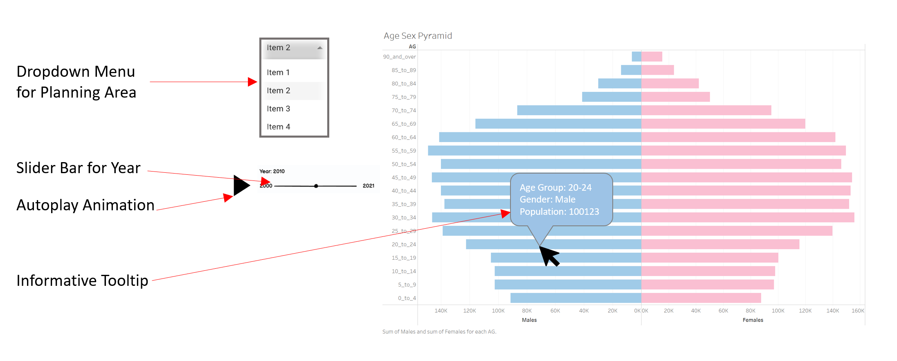

```{r setup, include=FALSE, results='asis'}
options(htmltools.dir.version = FALSE, knitr.duplicate.label = "allow")
knitr::opts_chunk$set(
  fig.retina = 3,
  cache = FALSE,
  echo = TRUE,
  message = FALSE, 
  warning = FALSE)
```

# 1 Overview
In this take-home exercise, we will explore interactivity and animation methods in designing an age-sex pyramid based data visualisation to show the changes of demographic structure of Singapore by age group and gender between 2000-2020 at planning area level.

## 1.1 Challenges Faced

+ Besides the challenges faced in data preparation in Take-Home Exercise 1, this data had to be further cleaned because some planning areas do not have any residents from 2000 to 2020. When including these areas, it may result in an empty and redundant plot. Hence, the locations with no residents were first identified and then filtered using the *filter()* function.

+ The interactive visualisation is complicated as some data transformation was required, and it consists of several widgets to be included. The data transformation was resolved by using the *transform - filter* function, and the tooltip, drop down menu and slider widgets were added using *plotly-hovermenu*, *layout-updatemenus* and *layout-sliders* respectively. However, I was unable to include the autoplay function, as when I use the *frame* tool, the plot's planning area could not be updated using the drop down list.

+ As the data set contains several unique instances of years (21) and planning areas (43), it is very tedious to define each instance to filter and name in the interactive plot. This was resolved by using a for loop to list out the unique years and planning areas in the data set.

# 2 Proposed Sketch

Below is the proposed sketch to apply appropriate interactivity and animation methods across the years at planning area level. It includes a:

+ Drop down menu for planning area selection

+ Slider bar with autoplay button for Year

+ Tooltip to improve clarity of information to user 



# 3 Installing Packages

The following packages and libraries were installed for this exercise:

+ **tidyverse** : A collection of core packages designed for data science, used extensively for
data preparation and wrangling.

+ **knitr**: Package used for dynamic report generation

+ **rmarkdown**: To convert rmarkdown documents into a variety of format

+ **plotly**: Used for creating interactive web-based graphs.

+ **ggiraph**: Used for creating dynamic ggplot graphs.

+ **gganimate**: Used to include the description of animations

+ **gifski**: Package used to convert images to gifs

```{r}
packages = c('tidyverse', 'knitr', 'rmarkdown', 'plotly', 'ggiraph', 'gganimate', 'gifski')
for(p in packages){
  if(!require(p, character.only = T)){
    install.packages(p)
  }
  library(p, character.only = T)
}
```

# 4 Dataset

For this task, the data sets used were retrieved from the Singapore [Department of Statistics home page](https://www.singstat.gov.sg/find-data/search-by-theme/population/geographic-distribution/latest-data). The title of the data sets are:

+ Singapore Residents by Planning Area / Subzone, Age Group, Sex and Type of Dwelling, June 2000-2010 

+ Singapore Residents by Planning Area / Subzone, Age Group, Sex and Type of Dwelling, June 2011-2020 

## 4.1 Data Preparation

#### **Import and combine data sets** 

The 2 data sets were first imported using the *read_csv()* function. As both data sets contain the same columns, we use *rbind()* to combine and merge them into 1 data set.

```{r, layout="l-body-outset"}
pop_00to10 <- read_csv("data/respopagesextod2000to2010.csv")
pop_10to20 <- read_csv("data/respopagesextod2011to2020.csv")

pop_00to20 <- rbind(pop_00to10, pop_10to20)

kable(head(pop_00to20))
```

#### **Compute the frequency count by Age Group, Sex, Time and Planning Area** 

The frequency count of the total population in Singapore by gender, age, time(year), and location(planning area) was computed. In the code chunk below, *group_by()* was used to group the orders by age, gender, time and planning area. Then, *summarise()* was used to count (i.e. n()) the number of residents.

The time column was also converted from numerical to integer using *as.integer()* function.

```{r}
freq_pop00to20 <- pop_00to20 %>%
  group_by(`AG`, `Sex`, `Time`, `PA`) %>%
  summarise('Count'= sum(`Pop`)) %>%
  ungroup()

freq_pop00to20$Time = as.integer(freq_pop00to20$Time)

kable(head(freq_pop00to20))
```

#### **Remove planning areas with no residents**

To identify planning areas with no residents, the *select()* function was first used to choose the 'PA' and 'Count' column. Next *group_by()* was used to group the orders by planning area and *summarise()* was used to count (i.e. n()) the total number of residents from 2000 to 2020. Then, *filter()* and *select()* was used to identify the planning areas with no residents, and reflect it as a column.

The column of planning areas with no residents was then converted to a list using *as.vector()*, and these planning areas were subsequently removed from the data set.

```{r}
no_pop <- freq_pop00to20 %>%
  select(`PA`, `Count`) %>%
  group_by(PA) %>%
  summarise(Total=sum(Count)) %>%
  filter(Total == 0) %>%
  select(PA) %>%
  ungroup

no_pop_list <- as.vector(no_pop$PA)

new_pop00to20 <- freq_pop00to20 %>%
  filter(!PA %in% no_pop_list)

kable(head(new_pop00to20))
```

## 4.2 Data Wrangling

By default, the values of the data frame is sorted according to the values of the first column. In this case, the values are sorted alphanumerically by the age group.

Hence, we will sort the data based on the categorical age-group assigned in the original dataset. This task is first performed by changing the order using *mutate()* and then sorting via *arrange()* of dpackage.

Next, *ifelse()* was used to convert population count of Male residents to be negative, so that their data will be plotted on the left side of the pyramid.

```{r, layout="l-body-outset"}
order <- c("0_to_4", "5_to_9", "10_to_14", "15_to_19", "20_to_24", "25_to_29", "30_to_34", "35_to_39", "40_to_44", "45_to_49", "50_to_54", "55_to_59", "60_to_64", "65_to_69", "70_to_74", "75_to_79", "80_to_84", "85_to_89", "90_and_over")

sorted_pop00to20 <- new_pop00to20 %>%
  mutate(AG =  factor(AG, levels = order)) %>%
  arrange(AG)

sorted_pop00to20$nCount = ifelse(sorted_pop00to20$Sex == "Males", 
                                 yes = -sorted_pop00to20$Count, 
                                 no = sorted_pop00to20$Count)

kable(head(sorted_pop00to20))
kable(tail(sorted_pop00to20))
```

# 5 Singapore's Age-Sex Pyramid

A [population pyramid](https://en.wikipedia.org/wiki/Population_pyramid) depicts the distribution of a population by age groups and sex. The pyramid can be used to visualize the age of a particular population. It is also used determine the overall age distribution of a population and an indication of the reproductive capabilities and likelihood of the continuation of a species.

## 5.1 By Year

#### **Animated Age-Sex Pyramid**

The first visualisation plotted is an animation of Singapore's Total Population from 2000 to 2020.

For this exercise, the static ggplot figure that was completed in Take-Home Exercise 1 was used. Using **gganimate** library, the static plot was converted into an animated pyramid via *transition_time()* and *ease_aes()* function. A moving subtitle was also included to relay the correct year information to the viewer.

```{r}
fig <-
  ggplot(sorted_pop00to20, aes(x = nCount, y = AG, fill = Sex)) +
  geom_col() +
  scale_x_continuous(breaks = seq(-150000, 150000, 50000), 
                     labels = paste0(as.character(c(seq(150, 0, -50), seq(50, 150, 50))),"k")) +
  labs (x = "Population", 
        y = "Age Group", 
        title='Singapore Age-Sex Population Pyramid') +
  theme_bw() +
  theme(axis.ticks.y = element_blank()) +
  scale_fill_manual(values = c("Males" = "lightblue", "Females" = "lightpink"))

fig + 
  transition_time(Time) +
  ease_aes('linear') +
  labs (subtitle = 'Year: {frame_time}')
```

## 5.2 By Year and Planning Location

Next, an interactive visualisation with a slider bar, dropdown menu and tooltip was created. This will enable the user to view the population pyramids for selected planning area across the years. As population numbers may differ drastically for different planning areas, hovering on the plot generates a tooltip which conveniently informs the user what is the age group, gender and population of each bar.

#### **Define time and planning area** 

The time and planning area for each unique instance were defined using a for loop. The annotation variables for the drop down menu was also defined.

```{r}
year_list <- list()
for (i in 1:length(unique(sorted_pop00to20$Time))) { 
  year_list[[i]] <- list(method = "restyle",
                         args = list("transforms[0].value", unique(sorted_pop00to20$Time)[i]),
                         label = unique(sorted_pop00to20$Time)[i])
}

PA_list <- list()
for (j in 1:length(unique(sorted_pop00to20$PA))) { 
  PA_list[[j]] <- list(method = "restyle",
                        args = list("transforms[1].value", unique(sorted_pop00to20$PA)[j]),
                        label = unique(sorted_pop00to20$PA)[j])
}

annot <- list(list(text = "Select Planning Area:",
                   x = 1.61,
                   y = 0.78,
                   xref = 'paper',
                   yref = 'paper',
                   showarrow = FALSE))
```

#### **Interactive graph with slider and dropdown menu**

An interactive graph was then generated using *plotly()*. A tooltip was added using the *hovertemplate* function to include age group, gender and population count.

The *transforms - filter* function was used to filter the data for each plot by 2 variables - Year and Planning Area. Next, *layout - Updatemenus* and *layout - Sliders* was used to include the interactive widgets for the plot - a drop down menu for the planning areas and a slider bar for the years respectively.

```{r}
plot_ly(sorted_pop00to20, 
        x = ~nCount, 
        y = ~AG,
        type = 'bar', 
        orientation = 'h',
        hovertemplate = ~paste("<br>Age Group:", AG,
                               "<br>Gender:", Sex,
                               "<br>Population:", Count),
        color = ~Sex,
        colors = c("lightpink", "lightblue"),
        transforms = list(list(type = 'filter',
                               target = ~Time,
                               operation = '=',
                               value = unique(sorted_pop00to20$Time)[1]),
                          list(type = 'filter',
                               target = ~PA,
                               operation = '=',
                               value = unique(sorted_pop00to20$PA)[1]))
                          )%>%
  layout(autosize = F, bargap = 0.1, barmode = 'overlay',
         xaxis = list(title = "Population",
                      tickmode = 'array', tickvals = c(-10000, -8000, -6000, -4000, -2000, 0, 
                                                       2000, 4000, 6000, 8000, 10000),
                      ticktext = c('10k', '8k', '6k', '4k', '2k', '0', 
                                   '2k', '4k', '6k', '8k', '10k')),
         yaxis = list(title = "Age Group"),
         title = 'Singapore Age-Sex Population Pyramid',
         updatemenus = list(list(type = 'dropdown',
                                 x = 1.6, y = 0.7,
                                 buttons = PA_list)
                            ),
         sliders = list(list(
                          active = 1, 
                          currentvalue = list(prefix = "Year: "), 
                          pad = list(t = 60), 
                          steps = year_list)), 
         annotations = annot)
```

$$\\[0.5in]$$

# 6 Conclusion

The insights from the visualisations are somewhat similar to that of Take-Home Exercise. Singapore and its planning areas tend to has a constrictive population because there is a lower percentage of younger people, indicates declining birth rates in Singapore, since each succeeding age group is getting smaller and smaller.

An interesting insight from interactive pyramid would be the difference between Mature and Non-mature estates. As with mature estates like Toa Payoh, within younger people, the younger the age group, the smaller the population. However, in non-mature estates like Punggol, within younger people, the younger the age group, the bigger the population. This may be an indication young adults setting up their families in non-mature estates, where most BTOs are built, hence bringing about more babies and children to the estate.

## 6.1 Tableau vs. R

+ Animations and interactivity in Tableau can easily be generated by a few clicks, whereas it requires more code and hence more tedious in R. However, this also means that visualisation in R is reproducible and repeatable as the steps can be traced back. 

+ R allows for more customisation of the visualisations as compared to Tableau. For example, the names widgets can be easily modified to detailed levels, whereas Tableau only takes in the data from the Table.

+ The animation in R may require more customisation to achieve less jerky animation as compared to Tableau.

# 7 References

+ [Functions](https://r4ds.had.co.nz/functions.html)

+ [Custom Buttons](https://plotly.com/r/custom-buttons/)

+ [Sliders](https://plotly.com/r/sliders/)

+ [Layout - Updatemenus](https://plotly.com/r/reference/#layout-updatemenus)

+ [Change Plot Size in Rmarkdown](https://stackoverflow.com/questions/52649044/change-output-width-of-plotly-chart-size-in-r-markdown-pdf-output)