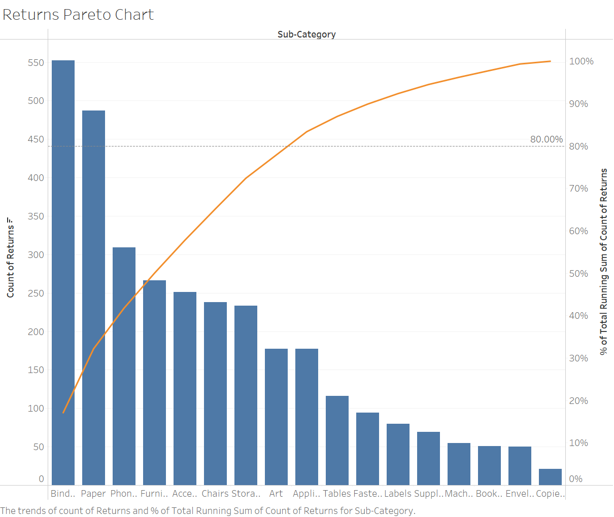
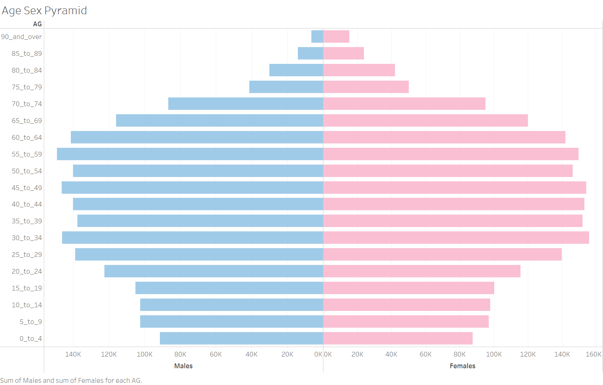

```{r setup, include=FALSE, results='asis'}
options(htmltools.dir.version = FALSE, knitr.duplicate.label = "allow")
knitr::opts_chunk$set(
  fig.retina = 3,
  cache = FALSE,
  echo = TRUE,
  message = FALSE, 
  warning = FALSE)
```

# 1. Overview 
In this take-home exercise, we will explore the pros and cons of creating data visualisations using **ggplot2** and Tableau. The two data visualisations included in this exercise are:

* A pareto chart showing the distribution of returns by a fictious superstore
* A population pyramid of Singapore by age cohort and gender

#### **Challenges Faced**

+ The raw data had to be extensively transformed before it could be used for visualisation. It is challenging to ensure that the fields have been adequately transformed, and frequently results in recycle work where one has to modify data wrangling after doing the visualisation and repeating again. For example, the Age Group column for the population pyramid has a character data type, which means that when plotting or generating dataframes including this column, 0_to_4 would be parsed first, followed by 10_to_14, instead of the expected 5_to_9. The order in the visualisation would be incorrect based on this order. The issue was resolved by manually changing the order using *mutate()* and then sorting via *arrange()*. 
+ The secondary axes in **ggplot2** is just based on a one-to-one transformation of the primary axes, hence the charts are still referenced to the primary axes. The challenge was resolved by transforming the secondary axis by a coefficient, such that the scale matches the primary axis. 
+ As **ggplot2** produces static charts, bringing in interactivity in the visualizations may be a challenge. This was resolved by using *plotly* package, which can be quickly transformed for the Age-Sex Population Pyramid. The pareto chart, which contained a secondary axis, required to be plotted using **plotly** tools. 
+ The default visualization created with **ggplot2** is not appealing and not professional looking. The default grey background was difficult to view for some charts and some of the default themes are not easy on the eyes. Hence, some charts may need to be extensively customized. For instance, the grid lines, axis labels, colour scheme of the pareto chart had to be customised. 

#### **Comparing between Tableau and R**

+ In R, data preparation for different charts using different data sets can be done on one platform using the same environment. Tableau, on the other hand requires separate workbook for separate data sets. On the other hand, web scraping cannot be performed on Tableau. Both pareto chart and population pyramid can be plotted in the same environment in R, whereas requires 2 workbooks in Tableau.
+ Tableau is more user friendly and fool-proof in creating visualisations. However, R has a rich repository of packages that directly creates different chart types, whereas Tableau requires some manipulation of base chart types. For example, though not carried out in this exercise, a basic pareto plot can be created by *stat_pareto()* of **ggQC**, and a basic population pyramid can be plotted using *nPyramid()* of **rCharts**.
+ Visualisations in Tableau are interactive, whereas **ggplot2** in R is static. Extra effort is also required to customise the details of the visualisation in **ggplot2**. Interactivity and customisation can be included through **ggplot** and **plotly**. Once a chart is created, the same visualisation using different variables or level of details can be easily re-created using similar lines of code. 

# 2. Proposed Sketch
Reference charts were already created using Tableau for in-class exercise 2, hence they will be used as the proposed sketch for the data visualisations for **ggplot2**.

#### Superstore Returns Pareto Chart by Tableau 


#### Singapore Population Pyramid 2021 by Tableau

As Tableau produces interactive charts and dashboards, we will use **plotly** to convert the **ggplot2** plots to produce interactive graphs for a more objective comparison.

# 3. Step-by-step Description

#### **Installing Packages**
A list of packages, namely **tidyverse**, **readxl**, **knitr**, **plotly** are required for this makeover exercise. This code chunk installs the required packages and loads them onto RStudio environment.

```{r}
packages = c('tidyverse', 'readxl', 'knitr', 'plotly')
for(p in packages){
  if(!require(p, character.only = T)){
    install.packages(p)
  }
  library(p, character.only = T)
}
```

# 3.1. Pareto Chart

Pareto charts show the ordered frequency counts of data. They show the ordered frequency counts of values for the different levels of a categorical or nominal variable. These charts are often used to identify areas to focus on first in process improvement, as supported by the [Pareto Principle (80/20 Rule)](https://en.wikipedia.org/wiki/Pareto_principle).

### 3.1.1 Import Dataset

The dataset to be used for the pareto chart is based on a fictitious superstore data by Tableau. It consists of three worksheets, namely: Orders, People and Returns.

Data import was accomplished using *read_xls()* of **readxl** package, which is useful for reading excel into a tibble.

```{r}
orders <- read_xls("data/Superstore-2021.xls",
                   sheet = "Orders")
returns <- read_xls("data/Superstore-2021.xls",
                   sheet = "Returns")
head(orders)
head(returns)
```

### 3.1.2 Data Wrangling

#### **Joining the two data frames** 

To combine the separate data frames, the *left_join()* of **dplyr** is used to join the returns data frame and orders data frame by using Order ID as the unique identifier.

```{r}
joined_tab <- left_join(returns, orders,
                        by = c('Order ID' = 'Order ID'))
head(joined_tab)
```

#### **Compute the frequency count by Sub-Category**

To achieve the frequency count of returns by sub-category, *group_by()* of **dplyr** package is used to group the orders by Sub-Category. Then, *summarise()* of **dplyr** is used to count (i.e. n()) the number of returned orders.

```{r}
freq_returned <- joined_tab %>%
  group_by(`Sub-Category`) %>%
  summarise('Returns'=n()) %>%
  ungroup()
head(freq_returned)
```

#### **Sorting data**

By default, the values of the tibble data frame is sorted according to the values of the first column. In this case, the values are sorted alphabetically by Sub-Category field. 

We will need to sort the sub-category field by descending order of values in the Returns field. To accomplish this task, the *arrange()* of **dplyr** package is used as shown in the code chunk below.

```{r}
freq_sorted <- freq_returned %>%
  arrange(desc(Returns))
head(freq_sorted)
```

#### **Compute the cumulative frequency**

Lastly, we can compute the cumulative frequency of returns by product sub-category. This task will be performed by using *mutate()* of **dplyr** package and *cumsum()* of Base R. 

The newly computed cumulative frequency values will be stored in a new field called cumfreq.

```{r}
freq_cum <- freq_sorted %>%
  mutate(cumfreq = cumsum(Returns)) %>%
  mutate(cum = cumsum(Returns)/sum(Returns))
head(freq_cum)
```

### 3.1.3 Plot Pareto Chart

#### **Static Pareto Chart**

A pareto chart was plotted using **ggplot2** as follows:

+ *geom_col()* instead of *geom_bar()* was used to create the bar chart as we do not need to modify the data, and want the height of the bar to represent the actual counts of returns.
+ *geom_line()* and *geom_point()* was used for the line and scatter plot for the cumulative frequency of return counts. The scatter plot helps reader to identify the corresponding cumulative frequency for each product in a static chart.
+ *scale_y_continuous()* was used to adjust the interval between the grid lines and add a secondary y axes for the cumulative percentage of returns for each product. The secondary y axes is just based on a one-to-one transformation of the primary axes, hence both bar and line charts are still plotted with reference to the primary axes.
+ *theme()* was lastly used to adjust the background color and grid lines of the plot to improve visibility to readers.

```{r}
pa <- ggplot(data = freq_cum, 
       aes(x = reorder(`Sub-Category`,-`Returns`))) +
  geom_col(aes(y=`Returns`), fill = 'lightblue', width= 0.8) +
  geom_point(aes(y=`cumfreq`), color = 'grey20', size = 0.8) +
  geom_line(aes(y =`cumfreq`, group = 1), colour = 'grey20', size = 0.4) +
  labs(x = "Sub-Category", title = "Pareto Chart of returns by sub-category") +
  scale_y_continuous(
    name = 'Returns (absolute frequency)', breaks = seq(0, 3500, 300), minor_breaks = seq(0, 3500, 100),
    sec.axis = sec_axis(~.*1/sum(freq_cum$Returns), name = 'Cumulative Frequency', breaks = seq(0, 1, by = 0.1), labels = scales::percent)
  ) +
    geom_hline(yintercept=0.8*sum(freq_cum$Returns), linetype="dashed", color = "grey50") +
  geom_text(aes(17, 0.8*sum(freq_cum$Returns), label = "80.0%", vjust = -0.5), size = 2) +
  theme(panel.background = element_rect(fill = 'white', colour = 'grey60', size = 0.5, linetype = 'solid'),
        panel.grid.major = element_line(size = 0.3, linetype = 'solid', colour = 'grey85'),
        panel.grid.minor = element_line(size = 0.2, linetype = 'solid', colour = 'grey90'),
        text = element_text(size = 5.5),
        axis.ticks.x = element_blank()) 
pa
```

#### **Interactive Pareto Chart**

From the previous chart plotted using **ggplot2**, the secondary y axes was based on a one-to-one transformation of the primary y axes. The bar and line charts were plotted with reference to the primary y axes, hence the secondary y axes will not be transferred to the interactive chart using *ggplotly()* of **plotly** library.

Therefore, an interactive pareto chart was plotted using *plot_ly()* from **plotly**. A scatter plot was not included in this case as one can simply hover across the line to view the corresponding cumulative percentage for each product. Similarly, hovering on the bars will reveal the absolute frequency of returns for each product sub-category. 

```{r}
plot_ly(freq_cum, x = ~reorder(`Sub-Category`,-`Returns`), y = ~`Returns`, type = "bar", name = "Returns") %>%
  add_trace(x = ~reorder(`Sub-Category`,-`Returns`), y = ~`cum`*100,type = "scatter", mode = "lines", yaxis = "y2", name = "Cum. %") %>%
  layout(title = "Pareto chart of returns by sub-category",
         xaxis = list(title = "Sub-Category"),
         yaxis = list(title = "Returns (Absolute Frequency)", showgrid = F),
         yaxis2 = list(overlaying = "y", side = "right", title = "Cumulative Percentage (%)", range = list(0, 100)),
         legend = list(orientation="h", yanchor="bottom",y=0.9,xanchor="top",x=0.2)) 
```

#### **Insights from Visualisation**

From the pareto chart, we can tell that 8 sub-categories account for 80% of the returned products. The sub-categories are Binders, Paper, Phones, Furnishings, Accessories, Chairs, Storage, Appliances and Art. As these are about 50% of the product sub-categories, the distribution of returns across can be considered relatively even. The store owners can still use the chart to focus on products with high returns such as Binders and Paper.

## 3.2. Population Pyramid

A [population pyramid](https://en.wikipedia.org/wiki/Population_pyramid) depicts the distribution of a population by age groups and sex. The pyramid can be used to visualize the age of a particular population. It is also used determine the overall age distribution of a population and an indication of the reproductive capabilities and likelihood of the continuation of a species.

### 3.2.1 Import Dataset

For this task, the data entitled Singapore Residents by Planning Area / Subzone, Age Group, Sex and Type of Dwelling, June 2021 should is used. The data set is available at [Department of Statistics home page](https://www.singstat.gov.sg/).

Data import was accomplished using *read_csv()* of **readr** package, which is useful for reading delimited files into a tibble.

```{r}
pop <- read_csv("data/respopagesextod2021.csv")
head(pop)
```

### 3.2.2 Data Wrangling

#### **Compute the frequency count by Age and Sex**

First, we are going to compute the frequency count of the total population in Singapore by gender and age. In the code chunk below, *group_by()* of **dplyr** package is used to group the orders by age and gender. Then, *summarise()* of **dplyr** is used to count (i.e. n()) the number of  residents.

```{r}
freq_pop <- pop %>%
  group_by(`AG`, `Sex`) %>%
  summarise('Count'= sum(`Pop`)) %>%
  ungroup()
head(freq_pop)
```

#### **Sort data table**

By default, the values of the tibble data frame is sorted according to the values of the first column. In this case, the values are sorted alphanumerically by the age group.

Hence, we will sort the data based on the categorical age-group assigned in the original dataset. This task is first performed by changing the order using *mutate()* and then sorting via *arrange()* of **dplyr** package.

```{r}
order <- c("0_to_4", "5_to_9", "10_to_14", "15_to_19", "20_to_24", "25_to_29", "30_to_34", "35_to_39", "40_to_44", "45_to_49", "50_to_54", "55_to_59", "60_to_64", "65_to_69", "70_to_74", "75_to_79", "80_to_84", "85_to_89", "90_and_over")

sorted_pop <- freq_pop %>%
  mutate(AG =  factor(AG, levels = order)) %>%
  arrange(AG)

head(sorted_pop)
```

### 3.2.3 Plot Age-Sex Population Pyramid

#### **Static Age-Sex Population Pyramid**

A Age-Sex Population Pyramid was plotted using **ggplot2** as follows:

+ *geom_col()* instead of *geom_bar()* was used to create the bar chart as we do not need to modify the data, and want the length of the bar to represent the actual population stats.
+ *ifelse()* of Base R function was convert population count of Male residents to be negative, so that their data will be plotted on the left side of the pyramid. 
+ *scale_x_continuous()* was used to modify the labels on the x-axis to provide better readability.

```{r}
p <- ggplot(sorted_pop, aes(x = ifelse(Sex == "Males", yes = -Count, no = Count), 
                          y = AG, fill = Sex)) + 
  geom_col() +
  scale_x_continuous(breaks = seq(-150000, 150000, 50000), 
                     labels = paste0(as.character(c(seq(150, 0, -50), seq(50, 150, 50))),"k")) +
  labs (x = "Population", y = "Age", title='Singapore Age-Sex Population Pyramid 2021') +
  theme_bw() +
  theme(axis.ticks.y = element_blank()) +
  scale_fill_manual(values = c("Males" = "lightblue", "Females" = "lightpink"))
p
```

#### **Interactive Age-Sex Population Pyramid**

The static pyramid was converted to an interactive chart by using *ggplotly()* of the **plotly** library. By hovering your mouse on the bars, you can view the population stats for each age group and gender.

```{r}
ggplotly(p,session="knitr")
```

#### **Insights from visualisation**

From the plot, we can tell that Singapore has a constrictive population because there is a lower percentage of younger people. This indicates declining birth rates in Singapore, since each succeeding age group is getting smaller and smaller. It may also represent a higher life expectancy for the older population. As Singapore enters into a silver economy, government bodies can use such data to put fourth appropriate measures and policies to manage its ageing population in the future.