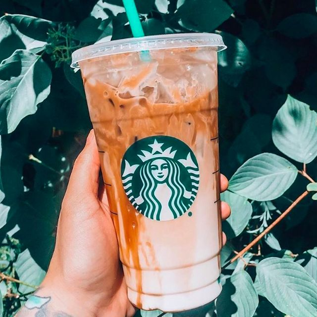

```{r setup, include=FALSE, results='asis'}
options(htmltools.dir.version = FALSE, knitr.duplicate.label = "allow")
knitr::opts_chunk$set(
  fig.retina = 3,
  cache = FALSE,
  echo = TRUE,
  message = FALSE, 
  warning = FALSE)
```

# 1 Overview

In this take-home exercise, we will explore creating data visualisations for multidimensional data, using starbucks drinks and their nutritional value.

{width=50%}

Source: [Starbucks](https://www.instagram.com/starbucks/?hl=en)

## 1.1 Challenges Faced

+ The dataset had to be cleaned before usage as the caffeine field contains strings due to range of values given for some drinks. For simplicity, max value of the range was used to conduct a more conservative analysis. This was resolved using a for loop and *ifelse()* condition. The field was converted to a numeric datatype before analysis.

+ The dataset contained drinks with different combinations of milk, whipped cream. Furthermore, the nutritional values are based on different size and volume for each drink. For an objective analysis, the milk type and whipped cream had to be taken into consideration and normalised by unit volume before clustering and plotting the heatmap. 

+ As this is my first time exploring in-depth into multidimensional data visualisations in R, it took me some time to get used to the customisation of the plot as compared to using ggplot2. By referring to the respective package documentations, I was able to adjust the size and colour of the correlation number label , glyphs, text labels on axis and colour labels on the corrplots.

# 2 Installing Packages

The following packages and libraries were installed for this exercise:

+ **tidyverse** : A collection of core packages designed for data science, used extensively for
data preparation and wrangling.

+ **knitr**: Package used for dynamic report generation

+ **rmarkdown**: Used to convert R Markdown documents into a variety of formats.

+ **corrplot**: Used for plotting a correlation matrix, test for correlation, and other visualization methods about association and correlation.

+ **ggstatsplot**: Used for creating graphics with details from statistical tests included

+ **heatmaply**: Used to plot 'heatmap', a popular graphical method for visualizing high-dimensional data

+ **parallelPlot**: Used to create a parallel coordinates plot

```{r}
packages = c('tidyverse','knitr', 'corrplot', 'ggstatsplot', 'rmarkdown', 'heatmaply', 'dendextend','parallelPlot')
for(p in packages){
  if(!require(p, character.only = T)){
    install.packages(p)
  }
  library(p, character.only = T)
}
```

# 3 Dataset

For this task, the Starbucks Drinks dataset is used.

## 3.1 Data Preparation

#### **Import and combine data sets** 

The dataset was imported using the *read_csv()* function.

```{r, layout="l-body-outset"}
drinks <- read_csv("data/starbucks_drink.csv")

kable(tail(drinks[,c(1:5, 15:18)]))
```

#### **Cleaning Caffeine(mg) Field**

The field 'Caffeing(mg)' is classified as a string datatype as some cells contains a range of values. Rows containing '40+' was first converted to '40'. Next, rows containing range i.e '25-40', were identified and converted to the max. value i.e. '60' using a for loop and *ifelse()* condition. Lastly, the column was converted to numeric datatype.

```{r}
drinks["Caffeine(mg)"][drinks["Caffeine(mg)"] == '40+'] <- '40'

for (i in 1:nrow(drinks)) {
  drinks[i, "Caffeine(mg)"] <- ifelse(grepl("–", drinks[i, "Caffeine(mg)"]),
                                      substr(drinks[i, "Caffeine(mg)"],
                                             nchar(drinks[i, "Caffeine(mg)"])-1,
                                             nchar(drinks[i, "Caffeine(mg)"])),
                                      drinks[i, "Caffeine(mg)"]
                                      )
}

drinks["Caffeine(mg)"] <- as.numeric(unlist(drinks["Caffeine(mg)"]))

kable(tail(drinks[,c(1:2, 15)]))
```

## 3.2 Data Wrangling

#### **Identifying Top 4 Largest Categories of Drinks**

To identify the largest drink categories, the *group_by()* function was used to group the orders by category and *summarise()* was used to count (i.e. n()) the total number of drinks for each category. Then, *arrange(desc)* was used to sort the data and *top_n()* was used to select and identify the top 4 largest categories. *filter()* was used to display rows of drinks that are in the top 4 largest categories. They are espresso, frappuccino blended beverages, kids and others, and tea.

```{r, layout="l-body-outset"}
top_cat <- drinks %>%
  group_by(`Category`) %>%
  summarise(Total=n()) %>%
  arrange(desc(Total)) %>%
  top_n(4) %>%
  ungroup

top_cat_list <- as.vector(top_cat$Category)

topcat <- drinks %>%
  filter(Category %in% top_cat_list)

kable(head(topcat[,c(1:5, 15:18)]))
```

#### **Identifying Top 3 Largest Drink Names**

To identify the largest drink names, the *group_by()* function was used to group the orders by name and *summarise()* was used to count (i.e. n()) the total number of drinks for each name. Then, *arrange(desc)* was used to sort the data and *top_n()* was used to select and identify the top 3 largest names. *filter()* was used to display rows of drinks that are in the top 3 largest names. They are iced coffee, hot chocolate and pumpkin spice crème.

```{r, layout="l-body-outset"}
top_drinks <- drinks %>%
  group_by(`Name`) %>%
  summarise(Total=n()) %>%
  arrange(desc(Total)) %>%
  top_n(3) %>%
  ungroup

top_drinks_list <- as.vector(top_drinks$Name)

topdrinks <- drinks %>%
  filter(Name %in% top_drinks_list)

kable(head(topdrinks[,c(1:5, 15:18)]))
```

#### **Normalising Against Volume of Drink**

As the nutritional value of the drinks contain different toppings i.e. milk and whipped cream, and are also based on different volumes and serving sizes, we will normalise the nutritional value by the volume of drink for each milk and whipped cream type.

The *group_by()* function was used to group the orders by name, milk and whipped cream and *summarise()* was calculate the nutritional value of the drink per unit volume. Next, the name, milk and whipped cream column was joined using *paste()* to create a single full name for the drink. The full name was then assigned to be the row name of the dataset using *row.names()*

```{r, layout="l-body-outset"}
topdrinks_norm <- topdrinks %>%
  group_by(`Name`, `Milk`, `Whipped Cream`) %>%
  summarise('Calories per oz'= mean(`Calories`/`Portion(fl oz)`),
            'Calories from fat per oz'= mean(`Calories from fat`/`Portion(fl oz)`),
            'Total Fat(g/oz)'= mean(`Total Fat(g)`/`Portion(fl oz)`),
            'Saturated fat(g/oz)'= mean(`Saturated fat(g)`/`Portion(fl oz)`),
            'Trans fat(g/oz)'= mean(`Trans fat(g)`/`Portion(fl oz)`),
            'Cholesterol(mg/oz)'= mean(`Cholesterol(mg)`/`Portion(fl oz)`),
            'Sodium(mg/oz)'= mean(`Sodium(mg)`/`Portion(fl oz)`),
            'Total Carbohydrate(g/oz)'= mean(`Total Carbohydrate(g)`/`Portion(fl oz)`),
            'Dietary Fiber(g/oz)'= mean(`Dietary Fiber(g)`/`Portion(fl oz)`),
            'Sugars(g/oz)'= mean(`Sugars(g)`/`Portion(fl oz)`),
            'Protein(g/oz)'= mean(`Protein(g)`/`Portion(fl oz)`),
            'Caffeine(mg/oz)'= mean(`Caffeine(mg)`/`Portion(fl oz)`)) %>%
  ungroup()

topdrinks_norm$Full_Name <- paste(topdrinks_norm$Name, topdrinks_norm$Milk, topdrinks_norm$`Whipped Cream`)

topdrinks_n <- topdrinks_norm %>%
  select(c(4:15))

row.names(topdrinks_n) <- topdrinks_norm$Full_Name

kable(head(topdrinks_n[,c(1:7)]))
```

# 4 Visualisation

In this section, we will explore data visualisations for multidimensional data using:

+ Corrgram
+ Heatmap
+ Parallel Coordinate Plot

## 4.1 Corrgram

A [corrgram](https://rpubs.com/gaston/corrgrams#:~:text=A%20corrgram%2C%20sometimes%20mistakenly%20referred,of%20a%20matrix%20of%20correlations.) is a visual display technique that helps us to represent the pattern of relations among a set of variables in terms of their correlations.

### 4.1.1 Corrgram using pairs()

The figure below shows a conventional corrgram using the *pairs()* function.

```{r, fig.width=6, fig.height=6}
panel.cor <- function(x, y, digits=2, prefix="", cex.cor, ...) {
  usr <- par("usr")
  on.exit(par(usr))
  par(usr = c(0, 1, 0, 1))
  r <- abs(cor(x, y, use="complete.obs"))
  txt <- format(c(r, 0.123456789), digits=digits)[1]
  txt <- paste(prefix, txt, sep="")
  if(missing(cex.cor)) cex.cor <- 0.8/strwidth(txt)
  text(0.5, 0.5, txt, cex = cex.cor * (1 + r) / 2)
}

pairs(drinks[,4:15], 
      upper.panel = panel.cor,
      label.pos = 0.5, 
      line.main = 3,
      cex.labels = 0.5, 
      font.labels = 0.5,
      gap = 0.2)
```

### 4.1.2 Corrgram using ggstatplot()

The figure below shows a corrgram using the **ggstatplot** package. *ggcorrplot* and *ggplot* elements can be added into the the corrgram to customise the corrgram's size and colour.

```{r}
ggstatsplot::ggcorrmat(
  data = drinks, 
  cor.vars = 4:15,
  ggcorrplot.args = list(outline.color = "black", 
                         hc.order = TRUE,
                         lab_col = "black",
                         lab_size = 2,
                         pch.col = "red",
                         pch.cex = 6),
  title = "Correlogram for Starbucks Drink dataset",
  subtitle = "One pair is not significant at p < 0.05",
  ggplot.component = list(theme_void(base_size = 9),
                          theme(plot.title=element_text(size=12),
                                plot.subtitle=element_text(size=9),
                                legend.text = element_text(size=6),
                                axis.text.x = element_text(size = 6, angle = 45, hjust = 0.6),
                                axis.text.y = element_text(size = 6, hjust = 1)
                                ))
  )
```

### 4.1.3 Multiple Corrgrams using ggstatplot()

The figure below shows multiple corrgrams using the *ggstatplot()* function.

```{r, fig.width=6, fig.height=6}
grouped_ggcorrmat(
    data = topcat,
    cor.vars = 4:15,
    grouping.var = Category,
    type = "p",
    p.adjust.method = "holm",
    plotgrid.args = list(ncol = 2),
    ggcorrplot.args = list(outline.color = "black",
                           lab_col = "black",
                           lab_size = 1.5,
                           pch.col = "red",
                           pch.cex = 3),
    annotation.args = list(tag_levels = "a",
    title = "Correlogram for Top 4 Categories of Starbucks Drink dataset",
    subtitle = "The categories are: Espresso, Frapuccino blended beverages, Kids Drinks and Tea"),
    ggplot.component = list(theme_void(base_size = 7),
                          theme(plot.title = element_text(size=5),
                                plot.subtitle = element_text(size=3),
                                legend.text = element_text(size=5),
                                axis.text.x = element_text(size = 5, angle = 45, hjust = 0.6),
                                axis.text.y = element_text(size = 5, hjust = 1),
                                strip.text.x = element_text(size = 7),
                                legend.key.size = unit(3, 'mm')
                                ))
    )

```

### 4.1.4 Corrgram with significant level of 0.1 using corrplot()

The figure below shows a corrgram using the **corrplot** combined with the significant test of 0.1. The corrgram reveals that not all correlation pairs are statistically significant. For example the correlation between total carbohydrate and sugar is statistically significant at significant level of 0.1 but not the pair between total caffeine and trans fat.

```{r}
drinks.cor <- cor(drinks[, 4:15])

drinks.sig = cor.mtest(drinks.cor, conf.level= .9)

corrplot.mixed(drinks.cor,
               lower = "number",
               upper = "square",
               order="AOE",
               tl.pos = "lt",
               tl.col = "black",
               tl.cex = .6,
               tl.srt = 45,
               pch.col = "grey70",
               pch.cex = 1.5,
               number.cex = .6,
               cl.cex = .6,
               lower.col = "black",
               p.mat = drinks.sig$p, 
               sig.level = 0.1,
               title = "Correlogram of Starbucks Drinks with significant level of 0.1",
               mar=c(0,0,1,0)
               )
```

### 4.1.5 Corrgram with hierarchical clustering

The *dend_expend()* and *find_k()* functions of dendextend package was used to determine the best clustering method and number of cluster.

```{r}
drinks_matrix <- data.matrix(drinks.cor)

drinks_d <- dist(normalize(drinks_matrix[c(1:12)]), method = "euclidean")

drinks_clust <- hclust(drinks_d, method = "average")
num_k <- find_k(drinks_clust)
plot(num_k)
```

Next, the corrgram was plotted using *corrplot()* and *hclust* based on the results of hierarchical clustering.

```{r}
corrplot(drinks.cor,
         method = "ellipse",
         order="hclust",
         hclust.method = "ward.D",
         addrect = 3,
         tl.pos = "lt",
         tl.col = "black",
         tl.cex = .6,
         tl.srt = 45,
         number.cex = .6,
         cl.cex = .6,
         title = "Correlogram of Starbucks Drinks with 3 levels of hierarchical cluster",
         mar=c(0,0,1,0))
```

### 4.1.6 Conclusion

In general, the corrgram for all starbucks drinks show that caffeine is mostly negatively correlated with the other nutritional factors except protein, whereas the rest are positively correlated. The diagram also shows that following pairs of nutritional factors of starbucks drinks are highly correlated (r > 0.90):

+ Total Fat(g) – Calories from Fat (r = 1)
+ Total Fat(g) – Saturated Fat(g) (r = 0.94)
+ Calories from fat – Saturated Fat (g) (r = 0.94)
+ Sugars (g) – Total Carbohydrate (g) (r = 0.99)
+ Sugars (g) – Calories (r = 0.92)
+ Total Carbohydrate (g) – Calories (r = 0.94)

The trans fat(g) and caffeine (mg) pair is not significant at p <0.05 and has a correlation parameter of only 0.01.

From the multiple corrgram, an interesting finding is that the caffeine for kids drinks and tea is positively correlated to the other factors.

The starbucks drinks nutrition factors can be separated into 3 clusters:

+ Caffeine (mg)
+ Trans fat(g), Cholesterol(mg), Saturated fat(g), Calories from fat, Total Fat(g)
+ Sodium (mg), Calories, Total Carbohydrate(g), Sugars(g), Dietary Fiber(g), Protein(g)

The nutrition factors in each cluster are correlated with one another. Caffeine is standalone as it is not highly correlated with the others and generally has a negative correlation with the rest. 

## 4.2 Heatmap

A [heatmap](https://en.wikipedia.org/wiki/Heat_map) is a data visualization technique that shows magnitude of a phenomenon as color in two dimensions. The variation in color may be by hue or intensity, giving obvious visual cues to the reader about how the phenomenon is clustered or varies over space.

The top drinks dataset where nutritional values have been normalised against the unit volume will be used for plotting the heat map.

First, the *dend_expend()* and *find_k()* functions of dendextend package was used to determine the best clustering method and number of cluster.

```{r}
topdrinks_matrix <- data.matrix(topdrinks_n)

topdrinks_d <- dist(normalize(topdrinks_matrix[c(1:12)]), method = "euclidean")

topdrinks_clust <- hclust(topdrinks_d, method = "average")
topnum_k <- find_k(topdrinks_clust)
plot(topnum_k)
```

Next, **heatmaply** package was used to plot the heatmap for Ice Coffee, Hot Chocolate and Pumpkin Spice Crème for different combinations of milk and whipped cream.

```{r, fig.width=6, fig.height=8}

heatmaply(percentize(topdrinks_matrix),
          colors = Blues,
          k_row = 4,
          margins = c(0, 100, 30, 50), #btm, left, top, right
          fontsize_row = 6,
          fontsize_col = 6,
          title= list(text = "Playing with Fonts",font = t1),
          xlab = "Nutrition",
          ylab = "Drinks",
          main = "Heatmap of Top 3 popular Starbucks Drinks")
```

### 4.2.1 Conclusion

The heatmap compares the nutritional value of hot chocolate, pumpkin spice crème and iced coffee, which are popular drinks in Starbucks. It shows that hot chocolate and pump spice crème are generally unhealthier, containing higher sodium, sugars, carbohydrates, and cholesterol levels than iced coffee. On the other hand, iced coffee contains higher caffeine levels than the hot chocolate and pump spice crème. 
The impact of milk, whipped cream, sweetener choices on the nutritional value of drinks were further analysed using hierarchical clustering. The drinks were separated into 4 clusters:

+ Hot Chocolate and Pumpkin Spice Crème with whipped cream or Pumpkin Spiced Crème with Whole/2% milk
+ Pumpkin Spice Crème without whipped cream with soy or nonfat milk
+ Hot Chocolate and Pumpkin Spice Crème without whipped cream 
+ Iced Coffee with all milk and sweetener combinations

For Hot Chocolate and Pumpkin Spice Crème, the nutritional value was determined by whipped cream then milk type. In general, no whipped cream and plant-based milk milk choices are considered healthier with lower sodium, sugars, carbohydrates, and cholesterol levels.
For Iced coffee, the nutritional value was determined by sweetener then milk type. Unsweetened iced coffee with plant-based milk is considered healthier with lower sodium, sugars, carbohydrates, and cholesterol levels.

## 4.3 Parallel Coordinate Plot

[Parallel coordinates](https://en.wikipedia.org/wiki/Parallel_coordinates) are a common way of visualizing and analyzing high-dimensional datasets. To show a set of points in an n-dimensional space, a backdrop is drawn consisting of n parallel lines, typically vertical and equally spaced. A point in n-dimensional space is represented as a polyline with vertices on the parallel axes; the position of the vertex on the i-th axis corresponds to the i-th coordinate of the point.

The parallel coordinate was plotted using the **parallelPlot** package.

```{r}
drinks.pp <- drinks %>%
  select(c(4:15))

histoVisibility <- rep(TRUE, ncol(drinks.pp))

parallelPlot(drinks.pp,
             rotateTitle = TRUE,
             continuousCS = 'YlGnBu',
             histoVisibility = histoVisibility)
```

### 4.3.1 Conclusion

The findings from the parallel coordinate plot are generally in line with the corrgram above. Drinks with high calories typically have high total carbohydrate, sugars, sodium and lower caffeine, vice versa. Some factors like trans fat, dietary fibre and cholesterol are generally not-well distributed with most drinks having a low nutritional value for those factors. They may not be a good indicator of the calorific content of the drinks.

# 5 References

+ [ggcorrplot](https://cran.r-project.org/web/packages/ggcorrplot/ggcorrplot.pdf)
+ [corrplot](https://www.rdocumentation.org/packages/corrplot/versions/0.2-0/topics/corrplot)
+ [heatmaply](https://cran.r-project.org/web/packages/heatmaply/vignettes/heatmaply.html)